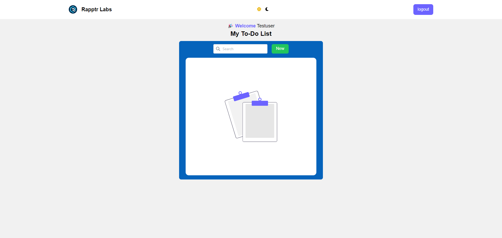
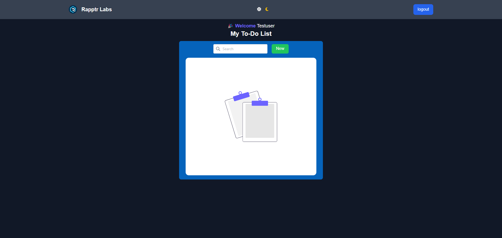

# Todo List App

## Overview
A simple Todo List web application built with React, TypeScript, and Tailwind CSS. The app allows users to create, edit, and delete tasks, as well as search for tasks by name.

## Features
- Add new tasks
- Edit existing tasks
- Delete tasks
- Search for tasks by name

## Technologies Used
- React
- TypeScript
- Tailwind CSS
- Vite
- React Router 
- Other dependencies

## Getting Started
To get started with the Todo List app, follow these steps:
1. Clone the repository:
git clone https://github.com/sohaibproject/todo-list.git
2. Install dependencies:
 cd todo-list
 npm install
3. Run the app 
## Screenshots

